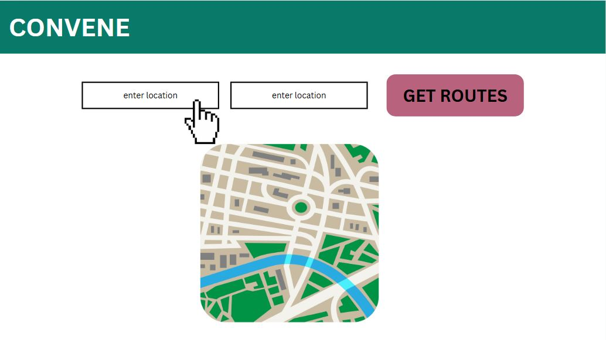
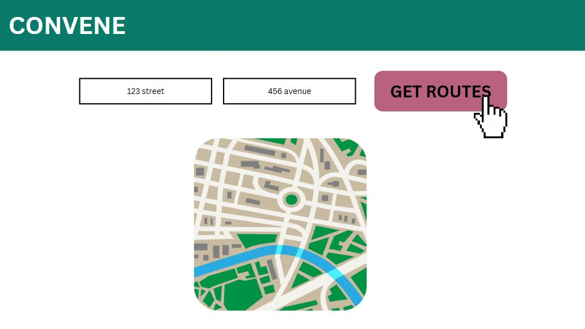
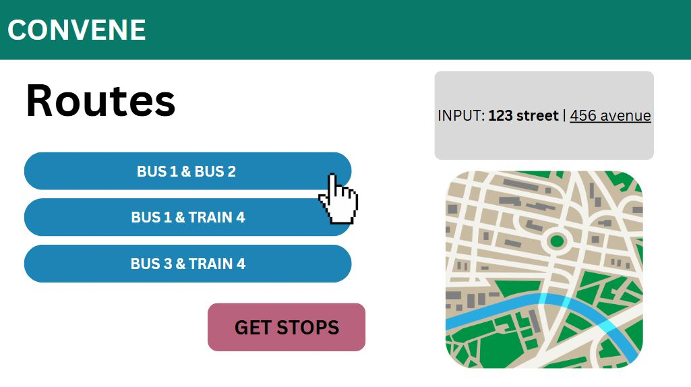
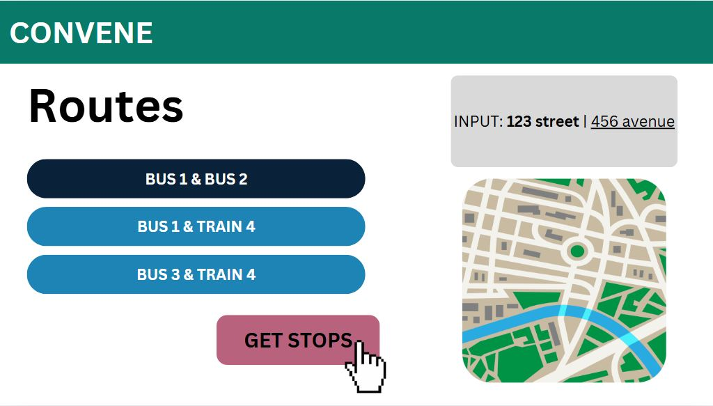
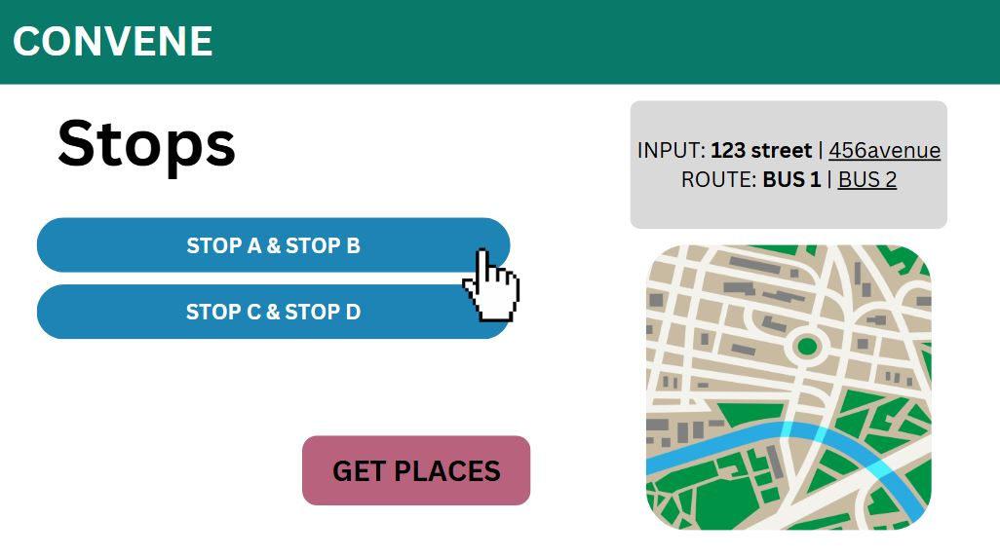
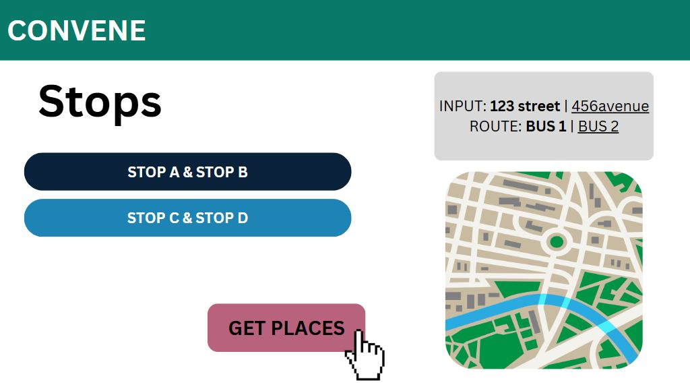
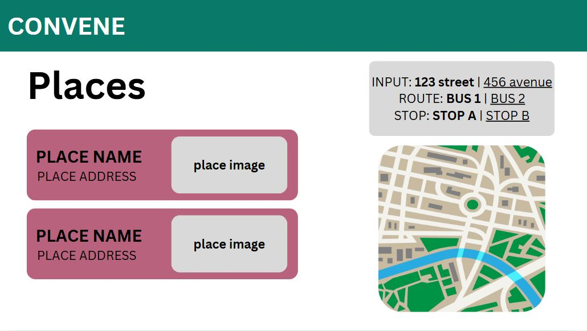
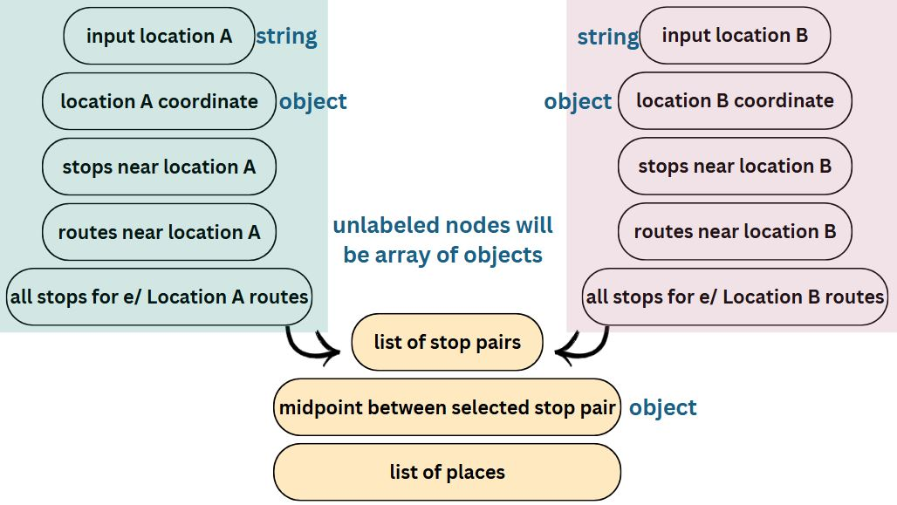
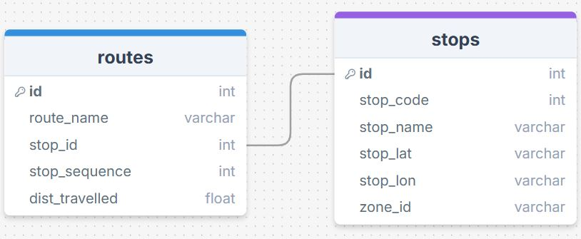

# Project Title

Convene

## Overview

This app is designed to help a user plan a hangout by suggesting places such as cafes and restaurants, along with the bus each person should take and the stop they will get off at. Currently, it is made for people in Vancouver, Burnaby, New Westminster, Coquitlam, Port Coquitlam, Port Moody, Richmond, Surrey, Delta, Tsawwassen, North Vancouver, West Vancouver, and Langley.

### Problem Space

To help people plan their meeting spots and make it accessible for both people, especially for those who rely on public transit.

It is sometimes challenging for people to decide on the optimal meeting location for hangouts. More so for commuters, as their destinations are limited by the transit options that are available to them. Inspired by this, my app eases the burden of searching for places that close to transit stops, along with being easily accessible from two starting locations using public transit in Metro Vancouver. Also to encourage the use of public transit, for the environment 😊.

### User Profile

A user wants to find places to hang out with their friend in Metro Vancouver, assuming the user knows the friend’s address. The user wants to use public trasnsit to find locations that are accessible for themselves and their friend using direct transit (no transfers).

### Features

User Manual:

1. Enter two locations (i.e your home address and your friend's home address) in the input fields and click 'Get Stops'. It will take you to the Routes page.
2. On the Routes page you will see the two starting locations. Under each location, you will see a list of routes that are within 500 meters of the starting location. This will take you to the Stops Page.
3. You will select one route from the first and one route from the second list and click 'Get Stops'. This will take you to the Places Page.
4. You will see a list of Intersection cards, which displays a destination stop from each location on the selected route. These are points where the two selected routes intersect.
5. You will select an Intersection card, and click 'Get Places' which will display the Places. You can also visualize the places on the interactive map. Clicking a Place card will highlight its location on the map as a pink star. Use the link provided on the Place card to discover mode details about the place.
6. The Places section displays a list of cafes and restaurants that are within 500 meters of the stop pairs.
7. You may click the back button present on every page to change your selection or address.

## Implementation

### Tech Stack

- React
- Express
- MYSQL
- Client Libraries:

  - react
  - react router dom
  - axios
  - sass
  - dotenv
  - react-leaflet
  - leaflet

- Server Libraries:
  - express
  - knex
  - grid index
  - dotenv
  - cors
  - mysql2
  - nodemon
  - axios

### APIs

- Overpass API (for places)
- Nominatim API (for geocoding)
- Photon API (for autocomplete)
- OpenStreetMap API (for map tiles)

### Sitemap

Home Page

- displayed on launch
- two input fields
- submit button (redirect to routes page)

Routes Page

- displays a list of nearby bus routes for the two given addresses
- submit button (redirect to stops page)
- back button (redirect to home page to change address)

Stops Page

- displays a list of intersecting stops of the two selected routes
- submit button (redirect to places page)
- back button (redirect to routes page to change selected routes)

Places Page

- displays a list of nearby places
- place category selection buttons (cafe and restaurant)
- back button (redirect to stops page to change selected stop)

Not Found Page

- displays error message
- back button (redirect to home page)

### Mockups

#### Home Page




#### Search Page







### Data




### Endpoints

**GET /routes**

- Get the nearby routes for the two given addresses

Parameters:

- 2 addresses: User-provided location as a string

Response:

```
[
  {
    "address": "789 Street",
    "routes": [
      {
        "route_id": 456,
        ...
      },
      {...}
    ]
  },
  {
    "address": "123 Avenue",
    "routes": [
      {
        "route_id": 1234,
           ...
      },
      {...}
    ]
  }
]
```

**GET /stops**

- Get intersecting stops between the two selected routes

Parameters:

- 2 selected routes: User-selected routes as a string

Response:

```
{
  "stops_1": [
    {
      "routeA_stop": {
        "stop_id": 123,
        ...
      },
      "routeB_stop": {
        "stop_id": 456,
        ...
      },
    }
    {...}
  ]
  ...
}
```

**GET /places**

- Get nearby places for a given coordinate

Parameters:

- coordinate: latitude and longitude

Response:

```
[
    {
        "place_id": "123
        ...
    }
    {...}
]
```

## Roadmap

### General to-do List

#### Buttons / Links

- submit starting locations ✅
- single route ✅
- submit route pair ✅
- single stop pair ✅

#### Components

- header ✅
- input form ✅
- routes list ✅
- stop pairs list ✅
- places list ✅
- selected items tracker card ✅

#### BACKEND

- set up database using knex ✅
- migrate and seed files ✅
- set up get requests ✅
- set up cors ✅
- set up .env and .env.sample files ✅
- connect to frontend ✅
- set up middleware ✅
- test on postman/thunderclient ✅

#### FRONTEND

- create components ✅
- style components ✅
- set up .env and .env.sample files ✅
- connect to backend ✅
- make api calls to the backend ✅
- test app ✅

### Diving Deeper

- Autocomplete for the address input fields; using Photon API ✅
- Interactive map component to display places; using map tiles from OpenStreetMap API ✅
- Filter suggested places by category ✅

### General Timeline

- complete backend by Friday, March 14th
- complete frontend by Thursday, March 19th
- final edits and practice presentation by Thursday, March 20th

---

## Future Implementations

- Copy to Clipboard feature for places list and other relevant details such as routes and stops; using clipboard API
- More location types eg. cinema, parks, beaches etc
- Show distance travelled from each starting location
- User can control the search radius for nearby bus stops, stop pairs, and places
